# 📱 WARF - WhatsApp API Gateway

## 📋 Table of Contents

- [Overview](#overview)
- [Technical Specifications](#technical-specifications)
- [Architecture](#architecture)
- [Features](#features)
- [Application Flow](#application-flow)
- [Database Schema](#database-schema)
- [API Endpoints](#api-endpoints)
- [Real-time Communication](#real-time-communication)
- [Security](#security)
- [Performance](#performance)

---

## 🎯 Overview

**WARF (WhatsApp API Gateway)** adalah aplikasi enterprise-grade yang menyediakan REST API untuk integrasi WhatsApp Business. Aplikasi ini memungkinkan pengelolaan multi-device WhatsApp, pengiriman pesan otomatis, kampanye broadcast, auto-reply, dan sistem queue yang robust.

### Key Highlights

- 🔐 **Multi-tenant SaaS Architecture** - Mendukung multiple users dengan subscription-based access
- 📱 **Multi-Device Support** - Kelola berbagai WhatsApp instance dalam satu platform
- 🚀 **High Performance Queue** - Redis-based message queue dengan retry logic
- 🎨 **Modern UI** - Dark-themed dashboard dengan DaisyUI dan glassmorphism
- 🔌 **Developer Friendly** - RESTful API dengan comprehensive documentation
- 🤖 **Intelligent Automation** - Auto-reply, scheduled messages, dan campaign management
- 📊 **Real-time Dashboard** - Socket.IO untuk live updates dan monitoring

---

## 🛠️ Technical Specifications

### Stack Overview

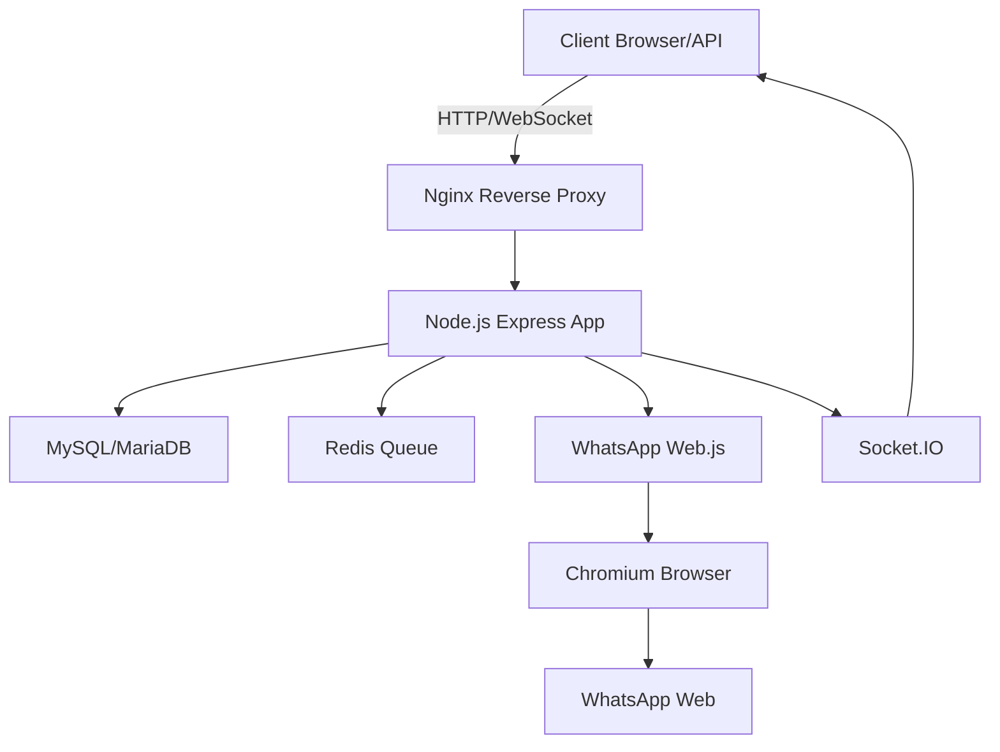

### Technology Details

#### Backend Framework
- **Runtime**: Node.js v20+ (CommonJS)
- **Framework**: Express.js 4.x
- **Architecture**: MVC Pattern with Service Layer
- **Routing**: Custom `@refkinscallv/express-routing` package
- **Language**: JavaScript (ES6+)

#### Database & ORM
- **Database**: MySQL 8.x / MariaDB 10.x
- **ORM**: Sequelize 6.x
- **Charset**: UTF8MB4 (Emoji support)
- **Migration**: Auto-sync dengan model definition

#### Queue & Cache
- **Queue System**: Bull (Redis-based)
- **Cache**: Redis 7.x
- **Priority Queue**: Mendukung Free/Premium tier dengan delay berbeda
- **Retry Logic**: Automatic retry hingga 3x dengan exponential backoff

#### WhatsApp Provider
- **Primary Provider**: `whatsapp-web.js` v1.34.6
- **Secondary Provider**: `@whiskeysockets/baileys` v7.0.0-rc.9 (Multi-provider support)
- **Browser**: Chromium/Chrome (Puppeteer)
- **Session Storage**: Local file-based persistence

#### Frontend
- **Template Engine**: EJS
- **CSS Framework**: Tailwind CSS 3.x
- **Component Library**: DaisyUI
- **Real-time**: Socket.IO Client
- **Animations**: Custom CSS transitions & glassmorphism

#### Security & Auth
- **Authentication**: JWT (JSON Web Token)
- **API Security**: API Key based authentication
- **Password Hashing**: bcrypt
- **Rate Limiting**: express-rate-limit
- **Security Headers**: Helmet.js
- **CORS**: Configurable cross-origin policy

#### DevOps & Monitoring
- **Process Manager**: PM2 (Cluster mode)
- **Logging**: Winston with daily rotation
- **Testing**: Jest (Unit & Integration tests)
- **Code Quality**: ESLint + Prettier
- **Pre-commit**: Husky + Lint-staged

### System Requirements

#### Production Server
| Component | Minimum | Recommended |
|-----------|---------|-------------|
| CPU | 2 vCPU | 4 vCPU |
| RAM | 2 GB | 4 GB |
| Storage | 20 GB SSD | 50 GB SSD |
| OS | Ubuntu 22.04 | Ubuntu 24.04 LTS |
| Node.js | v20.0.0 | v20.x (Latest) |
| MySQL | 8.0 | 8.0+ |
| Redis | 6.0 | 7.0+ |

#### Development Environment
- Node.js v20+
- MySQL/MariaDB
- Redis Server
- Chromium/Chrome browser

---

## 🏗️ Architecture

### Application Structure

```
whatsapp_provider/
├── app/                          # Application layer
│   ├── config.js                 # Centralized configuration
│   ├── http/                     # HTTP layer
│   │   ├── controllers/          # Request handlers (20 controllers)
│   │   ├── middlewares/          # Custom middlewares (12 middlewares)
│   │   └── validators/           # Request validation
│   ├── models/                   # Sequelize models (19 models)
│   ├── routes/                   # Route definitions
│   └── services/                 # Business logic (24 services)
├── core/                         # Framework core
│   ├── boot.core.js              # Application bootstrapper
│   ├── database.core.js          # Database management
│   ├── express.core.js           # Express setup
│   ├── jwt.core.js               # JWT utilities
│   ├── logger.core.js            # Winston logger
│   ├── mailer.core.js            # Email service
│   ├── socket.core.js            # Socket.IO setup
│   ├── server.core.js            # HTTP/HTTPS server
│   ├── runtime.core.js           # Runtime config
│   ├── errorHandler.core.js      # Global error handler
│   ├── hooks.core.js             # Lifecycle hooks
│   └── helpers/                  # Core utilities
├── public/                       # Static assets & views
│   ├── assets/                   # CSS, JS, Images
│   └── views/                    # EJS templates
├── scripts/                      # CLI utilities
│   ├── cli.js                    # Setup/Reset/Seed commands
│   └── database_seeder.js        # Initial data seeder
├── logs/                         # Application logs
├── whatsapp_sessions/            # WhatsApp session data
└── tmp/                          # Temporary files
```

### MVC Architecture

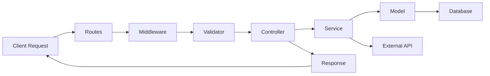

### Service Layer Architecture

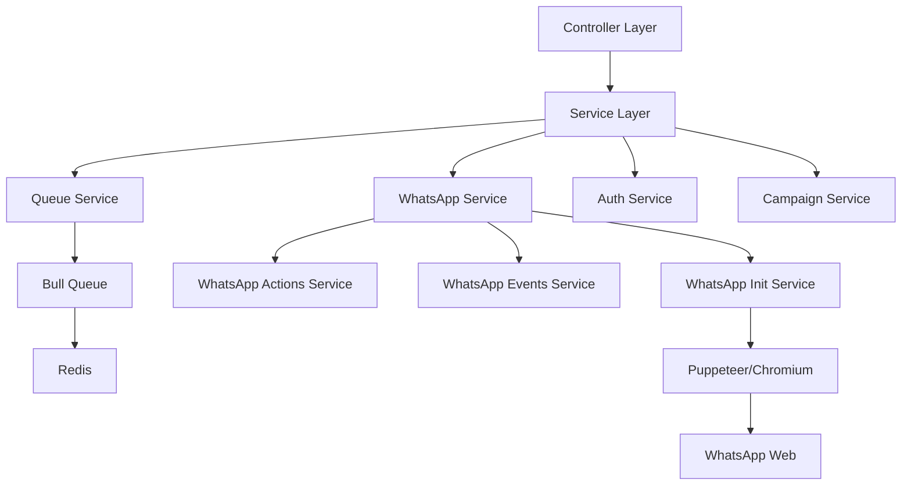

### Core Modules

#### 1. Boot Module
Mengelola lifecycle aplikasi dari start hingga shutdown.

```javascript
Boot.start() → Runtime → Logger → Database → Express → Socket → Server → Hooks
```

#### 2. Database Module
- Auto-load models dari direktori `app/models/`
- Support subdirectories recursive
- Model associations auto-configured
- Graceful connection management

#### 3. Express Module
- Middleware chain setup
- CORS configuration
- Static file serving
- EJS view engine
- File upload handling
- Cookie parsing

#### 4. Logger Module
- Winston-based logging
- Daily log rotation
- Multiple log levels (info, warn, error, debug)
- Separate error/combined logs
- Contextual logging

#### 5. Socket Module
- Socket.IO integration
- Real-time event broadcasting
- Room-based communication
- Authentication support

---

## ✨ Features

### 1. Authentication & User Management

#### Web Authentication
- 🔐 JWT-based session management
- 📧 Email verification (ready)
- 🔑 Password reset (ready)
- 👤 User profile management
- 🎫 Role-based access control

#### API Authentication
- 🔑 API Key generation
- 🌐 Domain/IP whitelisting
- 📊 API usage tracking
- 🔒 Rate limiting per key

### 2. Device Management

#### Multi-Device Support
- ➕ Add multiple WhatsApp devices
- 📱 QR code pairing via web dashboard
- 🔄 Auto-reconnect mechanism
- 📊 Device status monitoring
- 🗑️ Device removal & cleanup

#### Device Features
- **Status Tracking**: Online/Offline/Connecting/Error
- **Session Persistence**: File-based session storage
- **Health Check**: Regular status polling
- **Auto-recovery**: Automatic reinitialize on failure
- **Provider Selection**: whatsapp-web.js atau Baileys

### 3. Messaging System

#### Single Message
```javascript
POST /api/messages/send
{
  "device_id": 1,
  "recipient": "6281234567890",
  "message": "Hello from WARF!",
  "type": "text"
}
```

#### Bulk Message
```javascript
POST /api/messages/bulk
{
  "device_id": 1,
  "recipients": ["6281...", "6282..."],
  "message": "Broadcast message",
  "delay": 5000  // ms between messages
}
```

#### Media Support
- 📷 Image (JPEG, PNG, GIF)
- 📹 Video (MP4, AVI)
- 🎵 Audio (MP3, OGG)
- 📄 Document (PDF, DOCX, XLSX)
- 📎 Auto MIME type detection
- 💾 Base64 encoding support

### 4. Campaign Management

#### Broadcast Campaigns
- 📢 Mass messaging dengan segmentasi
- 📋 Contact book integration
- ⏱️ Delayed sending untuk anti-ban
- 📊 Campaign analytics
- 🎯 Target audience selection

#### Campaign Features
- **Queue Priority**: Premium users mendapat priority
- **Rate Limiting**: Configurable delay antar pesan
- **Progress Tracking**: Real-time campaign progress
- **Status Monitoring**: Success/Failed message tracking
- **Retry Logic**: Auto retry untuk failed messages

### 5. Scheduled Messages

#### One-time Schedule
```javascript
{
  "scheduled_at": "2026-02-15 10:00:00",
  "message": "Reminder message",
  "recipients": ["628..."]
}
```

#### Recurring Schedule
- 📅 Daily, Weekly, Monthly patterns
- 🔄 Custom recurrence rules
- 🎯 Flexible scheduling
- 📊 Series history tracking
- ⏸️ Pause/Resume capability

### 6. Auto-Reply System

#### Keyword-based Automation
```javascript
{
  "keyword": "PRICE",
  "reply_type": "exact",  // exact, contains, starts_with, ends_with
  "reply_message": "Our pricing starts at $10/month",
  "is_active": true
}
```

#### Auto-Reply Features
- 🎯 Multiple keyword match types
- 📊 Hit counter tracking
- ⏰ Schedule-based activation
- 🔄 Multi-device support
- 📝 Template variable support

### 7. Contact Management

#### Contact Sync
- 📱 Auto-sync dari WhatsApp device
- 👥 Manual contact import
- 📋 Contact book organization
- 🏷️ Tag management
- 🔍 Advanced search & filtering

#### Contact Book
- 📚 Multiple contact books
- 👥 Grouping contacts
- 📊 Contact segmentation
- 📤 Export/Import CSV
- 🔗 Campaign targeting

### 8. Message Queue System

#### Queue Features
- 🚀 Redis-based Bull queue
- ⚡ Priority-based processing
- 🔄 Automatic retry (max 3x)
- 📊 Queue monitoring dashboard
- ⏱️ Configurable delays

#### Queue Types
| Type | Delay | Priority | Use Case |
|------|-------|----------|----------|
| Instant | 0ms | High | Premium users |
| Standard | 5000ms | Normal | Free users |
| Campaign | Custom | Low | Bulk messages |

#### Processing Flow
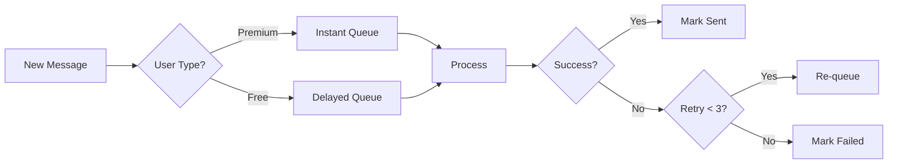

### 9. Template Management

#### Message Templates
- 💾 Save frequently used messages
- 🔤 Variable placeholders ({{name}}, {{phone}})
- 📁 Categorization
- 🔍 Template search
- 📋 Quick use in campaigns

### 10. Webhook Integration

#### Event Notifications
```javascript
{
  "url": "https://yourdomain.com/webhook",
  "events": ["message_sent", "message_received", "message_failed"],
  "is_active": true
}
```

#### Webhook Events
- ✅ `message_sent` - Pesan berhasil terkirim
- ❌ `message_failed` - Pesan gagal terkirim
- 📩 `message_received` - Pesan masuk
- 📱 `device_connected` - Device terhubung
- 🔌 `device_disconnected` - Device terputus
- 📞 `qr_received` - QR code ready

### 11. Subscription Management

#### Package System
```javascript
{
  "name": "Premium Plan",
  "price": 100000,
  "features": {
    "max_devices": 5,
    "max_contacts": 10000,
    "max_messages_per_day": 5000,
    "queue_priority": "high",
    "api_access": true
  }
}
```

#### Subscription Features
- 📦 Multiple pricing tiers
- ⏰ Auto-expiry checking
- 📊 Usage tracking
- 🔔 Expiry notifications
- 💳 Manual renewal (Payment gateway ready)

### 12. Dashboard & Monitoring

#### Admin Dashboard
- 📊 Real-time statistics
- 📈 Message analytics
- 👥 User management
- 💼 Subscription overview
- 🔧 System settings

#### Statistics Displayed
- Total messages sent (today/week/month)
- Device status overview
- Active campaigns
- Queue status
- Subscription status
- API usage

### 13. Developer Tools

#### Number Checker
```javascript
POST /api/tools/check-numbers
{
  "numbers": ["6281234567890", "6289876543210"]
}
// Returns: { "6281...": true, "6289...": false }
```

#### Features
- ✅ Bulk WhatsApp number validation
- 📊 Export results to CSV/JSON
- 📈 Progress indicator
- 🔄 Batch processing

---

## 🔄 Application Flow

### 1. Application Startup Flow

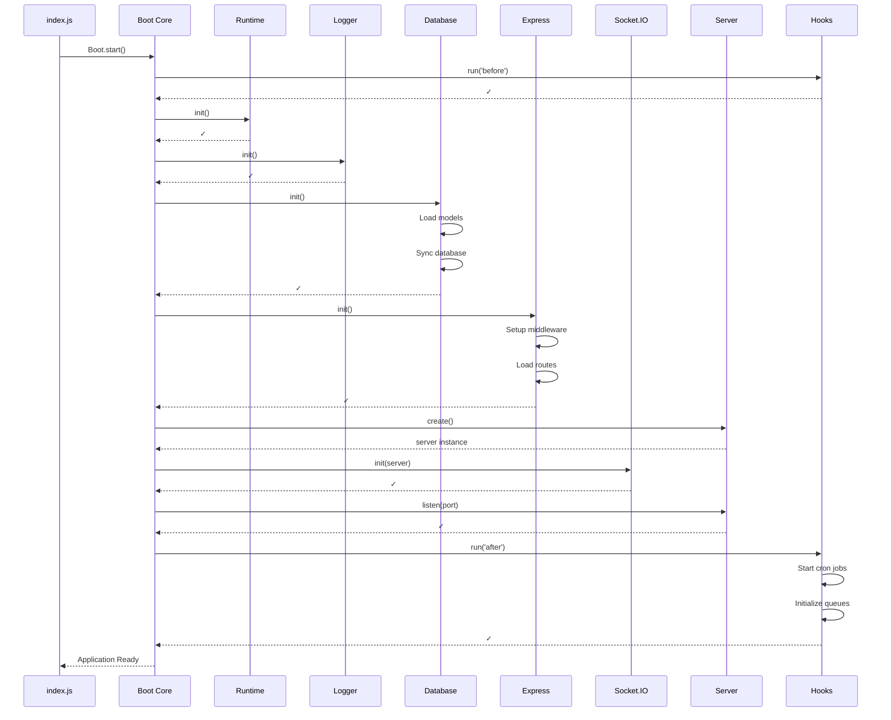

### 2. User Authentication Flow

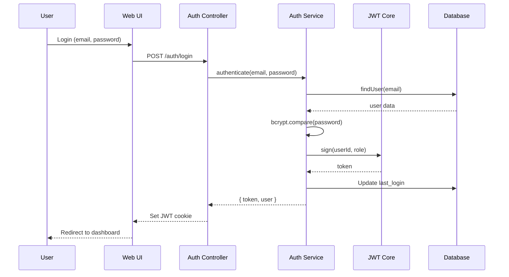

### 3. Device Pairing Flow

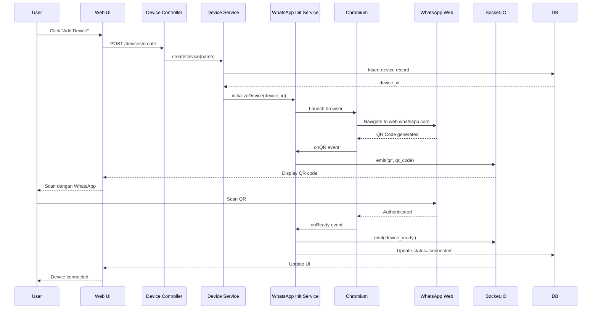

### 4. Message Sending Flow (via API)

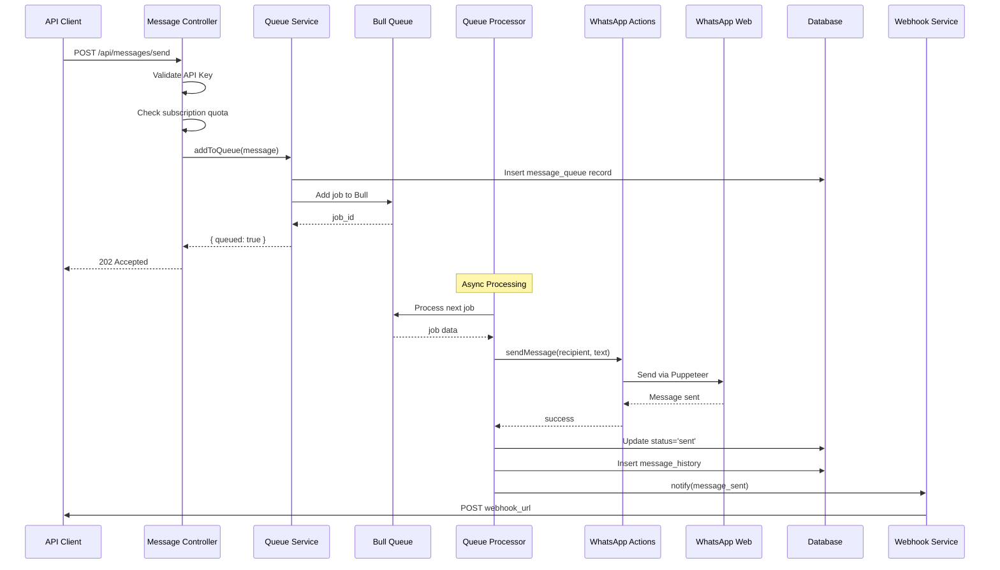

### 5. Campaign Execution Flow

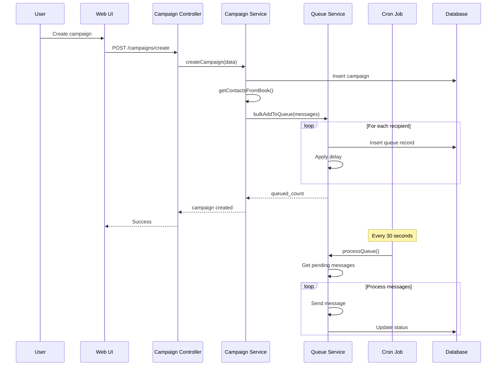

### 6. Auto-Reply Flow

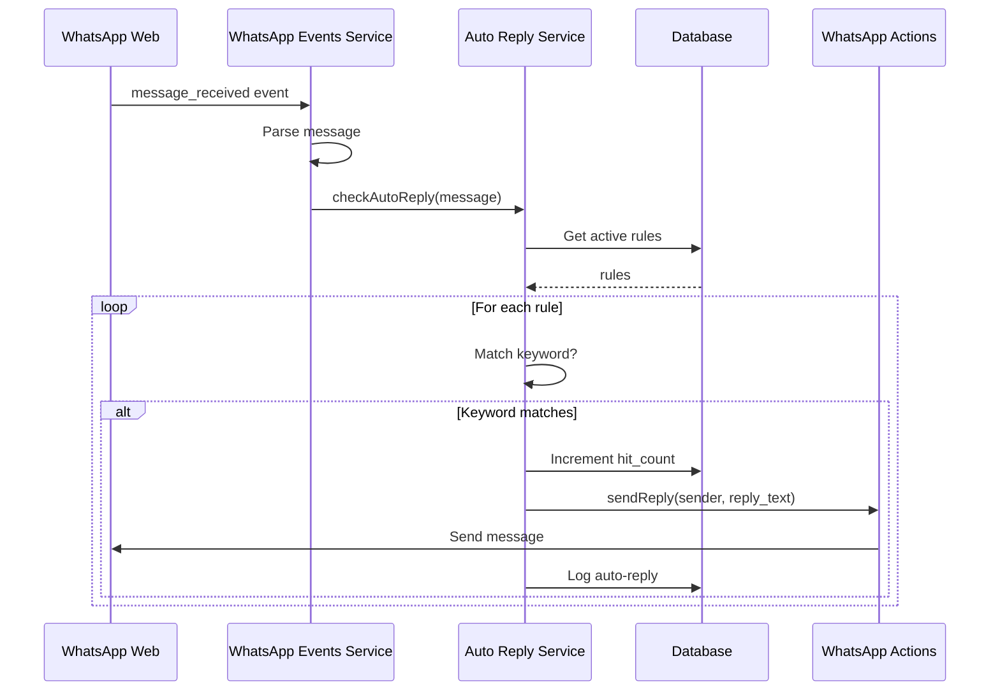

### 7. Scheduled Message Flow

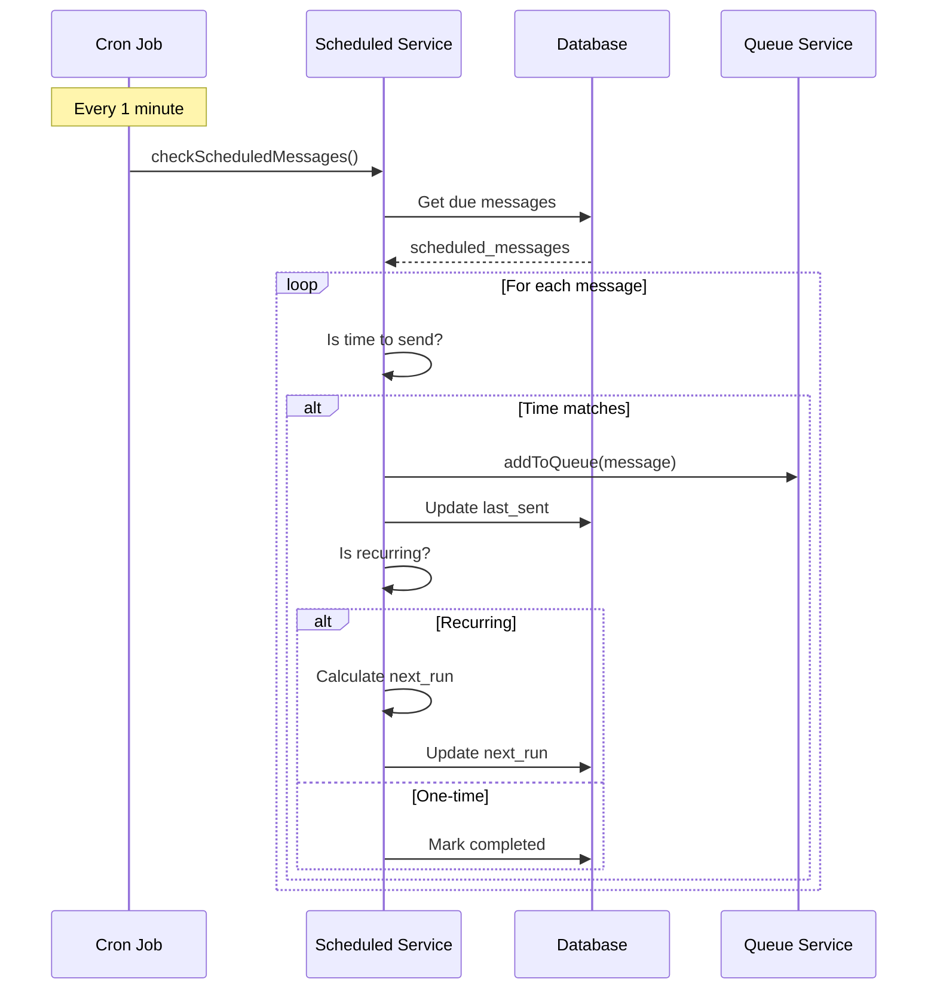

### 8. Real-time Updates Flow (Socket.IO)

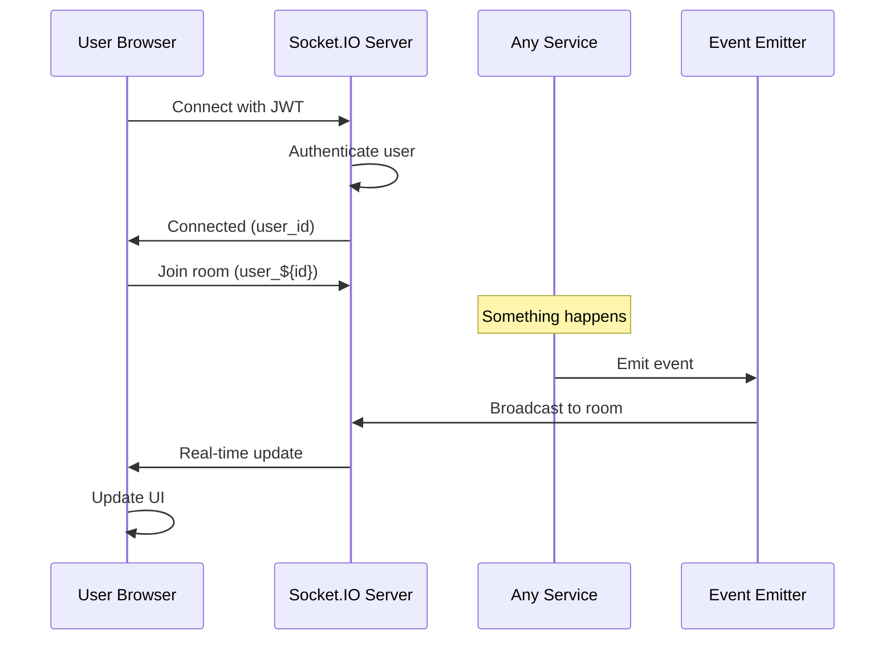

---

## 💾 Database Schema

### Entity Relationship Diagram

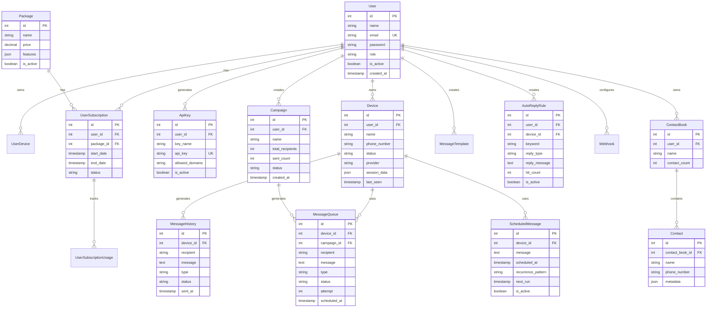

### Key Tables

#### 1. `users`
Menyimpan data pengguna aplikasi.

| Field | Type | Description |
|-------|------|-------------|
| id | INT | Primary key |
| name | VARCHAR(255) | Nama lengkap |
| email | VARCHAR(255) | Email (unique) |
| password | VARCHAR(255) | Hashed password |
| role | ENUM | admin/user |
| is_active | BOOLEAN | Status aktif |
| created_at | TIMESTAMP | Waktu registrasi |

#### 2. `devices`
Menyimpan informasi WhatsApp device.

| Field | Type | Description |
|-------|------|-------------|
| id | INT | Primary key |
| user_id | INT | FK ke users |
| name | VARCHAR(100) | Nama device |
| phone_number | VARCHAR(20) | Nomor WA |
| status | ENUM | connected/disconnected/error |
| provider | ENUM | whatsapp-web.js/baileys |
| session_data | JSON | Session persistence |
| last_seen | TIMESTAMP | Last active time |

#### 3. `message_queue`
Queue untuk message sending.

| Field | Type | Description |
|-------|------|-------------|
| id | INT | Primary key |
| device_id | INT | FK ke devices |
| campaign_id | INT | FK ke campaigns (nullable) |
| recipient | VARCHAR(20) | Nomor tujuan |
| message | TEXT | Konten pesan |
| type | VARCHAR(20) | text/image/video/audio/document |
| media_url | TEXT | URL media file |
| status | ENUM | pending/processing/sent/failed |
| attempt | INT | Retry count (max 3) |
| priority | INT | Queue priority |
| scheduled_at | TIMESTAMP | Kapan harus dikirim |
| processed_at | TIMESTAMP | Waktu proses |

#### 4. `message_history`
Log semua pesan yang terkirim.

| Field | Type | Description |
|-------|------|-------------|
| id | INT | Primary key |
| device_id | INT | FK ke devices |
| recipient | VARCHAR(20) | Nomor tujuan |
| message | TEXT | Konten pesan |
| type | VARCHAR(20) | text/image/etc |
| status | ENUM | sent/failed |
| error_message | TEXT | Error jika gagal |
| sent_at | TIMESTAMP | Waktu terkirim |

#### 5. `campaigns`
Broadcast campaigns.

| Field | Type | Description |
|-------|------|-------------|
| id | INT | Primary key |
| user_id | INT | FK ke users |
| name | VARCHAR(255) | Nama campaign |
| message | TEXT | Template pesan |
| total_recipients | INT | Jumlah penerima |
| sent_count | INT | Sudah terkirim |
| failed_count | INT | Gagal kirim |
| status | ENUM | draft/queued/running/completed/failed |
| created_at | TIMESTAMP | Waktu dibuat |

#### 6. `auto_reply_rules`
Rules untuk auto-reply.

| Field | Type | Description |
|-------|------|-------------|
| id | INT | Primary key |
| user_id | INT | FK ke users |
| device_id | INT | FK ke devices |
| keyword | VARCHAR(255) | Keyword trigger |
| reply_type | ENUM | exact/contains/starts_with/ends_with |
| reply_message | TEXT | Balasan otomatis |
| hit_count | INT | Berapa kali triggered |
| is_active | BOOLEAN | Status aktif |

#### 7. `scheduled_messages`
Scheduled & recurring messages.

| Field | Type | Description |
|-------|------|-------------|
| id | INT | Primary key |
| device_id | INT | FK ke devices |
| recipients | JSON | Array nomor tujuan |
| message | TEXT | Konten pesan |
| scheduled_at | TIMESTAMP | Waktu kirim (one-time) |
| recurrence_pattern | VARCHAR(50) | daily/weekly/monthly |
| recurrence_config | JSON | Konfigurasi recurrence |
| next_run | TIMESTAMP | Next execution time |
| last_sent | TIMESTAMP | Last sent time |
| is_active | BOOLEAN | Status aktif |
| scheduled_msg_token | VARCHAR(36) | UUID untuk series grouping |

---

## 🔌 API Endpoints

### Authentication Endpoints

```
POST   /api/auth/register          # Register new user
POST   /api/auth/login             # User login
POST   /api/auth/logout            # User logout
GET    /api/auth/profile           # Get user profile
PUT    /api/auth/profile           # Update profile
POST   /api/auth/change-password   # Change password
```

### Device Management

```
GET    /api/devices                # List all devices
POST   /api/devices                # Create new device
GET    /api/devices/:id            # Get device detail
PUT    /api/devices/:id            # Update device
DELETE /api/devices/:id            # Delete device
POST   /api/devices/:id/connect    # Connect device
POST   /api/devices/:id/disconnect # Disconnect device
GET    /api/devices/:id/status     # Get device status
GET    /api/devices/:id/qr         # Get QR code
```

### Messaging

```
POST   /api/messages/send          # Send single message
POST   /api/messages/bulk          # Send bulk messages
GET    /api/messages/history       # Message history
GET    /api/messages/queue         # Queue status
DELETE /api/messages/queue/:id     # Cancel queued message
```

### Campaigns

```
GET    /api/campaigns              # List campaigns
POST   /api/campaigns              # Create campaign
GET    /api/campaigns/:id          # Campaign detail
PUT    /api/campaigns/:id          # Update campaign
DELETE /api/campaigns/:id          # Delete campaign
POST   /api/campaigns/:id/start    # Start campaign
POST   /api/campaigns/:id/pause    # Pause campaign
POST   /api/campaigns/:id/resume   # Resume campaign
GET    /api/campaigns/:id/stats    # Campaign statistics
```

### Scheduled Messages

```
GET    /api/scheduled              # List scheduled messages
POST   /api/scheduled              # Create scheduled message
GET    /api/scheduled/:id          # Get scheduled detail
PUT    /api/scheduled/:id          # Update scheduled
DELETE /api/scheduled/:id          # Delete scheduled
POST   /api/scheduled/:id/pause    # Pause scheduled
POST   /api/scheduled/:id/resume   # Resume scheduled
```

### Auto-Reply

```
GET    /api/auto-replies           # List auto-reply rules
POST   /api/auto-replies           # Create rule
GET    /api/auto-replies/:id       # Get rule detail
PUT    /api/auto-replies/:id       # Update rule
DELETE /api/auto-replies/:id       # Delete rule
POST   /api/auto-replies/:id/toggle # Enable/disable rule
```

### Contacts & Contact Books

```
GET    /api/contacts               # List contacts
POST   /api/contacts               # Create contact
POST   /api/contacts/import        # Import contacts (CSV)
GET    /api/contacts/:id           # Contact detail
PUT    /api/contacts/:id           # Update contact
DELETE /api/contacts/:id           # Delete contact

GET    /api/contact-books          # List contact books
POST   /api/contact-books          # Create contact book
GET    /api/contact-books/:id      # Book detail
PUT    /api/contact-books/:id      # Update book
DELETE /api/contact-books/:id      # Delete book
```

### Templates

```
GET    /api/templates              # List templates
POST   /api/templates              # Create template
GET    /api/templates/:id          # Template detail
PUT    /api/templates/:id          # Update template
DELETE /api/templates/:id          # Delete template
```

### Webhooks

```
GET    /api/webhooks               # List webhooks
POST   /api/webhooks               # Create webhook
GET    /api/webhooks/:id           # Webhook detail
PUT    /api/webhooks/:id           # Update webhook
DELETE /api/webhooks/:id           # Delete webhook
POST   /api/webhooks/:id/test      # Test webhook
```

### API Keys

```
GET    /api/keys                   # List API keys
POST   /api/keys                   # Generate new key
GET    /api/keys/:id               # Key detail
PUT    /api/keys/:id               # Update key
DELETE /api/keys/:id               # Revoke key
```

### Tools

```
POST   /api/tools/check-numbers    # Check if numbers registered on WA
POST   /api/tools/send-bulk        # Bulk send utility
```

### Admin Endpoints

```
GET    /api/admin/users            # List all users
GET    /api/admin/users/:id        # User detail
PUT    /api/admin/users/:id        # Update user
DELETE /api/admin/users/:id        # Delete user
POST   /api/admin/users/:id/toggle # Enable/disable user

GET    /api/admin/packages         # List packages
POST   /api/admin/packages         # Create package
PUT    /api/admin/packages/:id     # Update package
DELETE /api/admin/packages/:id     # Delete package

GET    /api/admin/settings         # System settings
PUT    /api/admin/settings         # Update settings

GET    /api/admin/stats            # System statistics
GET    /api/admin/logs             # Application logs
```

---

## 📡 Real-time Communication

### Socket.IO Events

#### Client → Server

```javascript
// Connect with authentication
socket.emit('authenticate', { token: 'jwt_token' })

// Join specific rooms
socket.emit('join_device_room', { device_id: 1 })
```

#### Server → Client

```javascript
// Device events
socket.on('qr_received', (data) => {
  // { device_id, qr_code }
})

socket.on('device_ready', (data) => {
  // { device_id, phone_number }
})

socket.on('device_disconnected', (data) => {
  // { device_id, reason }
})

// Message events
socket.on('message_sent', (data) => {
  // { message_id, recipient, status }
})

socket.on('message_received', (data) => {
  // { device_id, sender, message }
})

socket.on('message_failed', (data) => {
  // { message_id, error }
})

// Campaign events
socket.on('campaign_progress', (data) => {
  // { campaign_id, sent, total, percentage }
})

// Queue events
socket.on('queue_updated', (data) => {
  // { pending, processing, sent, failed }
})

// Notification events
socket.on('notification', (data) => {
  // { type, message, data }
})
```

---

## 🔐 Security

### Authentication & Authorization

#### JWT Authentication
- Token expires: 7 days (configurable)
- Token stored in HTTP-only cookie
- Auto-refresh on activity
- Secure secret key (64+ characters)

#### API Key Authentication
- 32-character random key
- Domain/IP whitelisting
- Per-key rate limiting
- Usage tracking

### Security Measures

1. **Password Security**
   - bcrypt hashing (10 rounds)
   - Minimum 8 characters
   - Password reset with email verification

2. **Input Validation**
   - express-validator for request validation
   - XSS prevention
   - SQL injection prevention (Sequelize ORM)
   - File upload validation (type, size)

3. **Rate Limiting**
   - API endpoints: 100 req/15min per IP
   - Login attempts: 5 per 15min
   - Message sending: Based on subscription

4. **CORS Policy**
   - Configurable allowed origins
   - Credentials support
   - Preflight caching

5. **Security Headers**
   - Helmet.js integration ready
   - X-Frame-Options
   - X-Content-Type-Options
   - Strict-Transport-Security (HTTPS)

6. **Session Management**
   - Secure session storage
   - Session expiry
   - Device-based sessions for WhatsApp

---

## ⚡ Performance

### Optimization Strategies

#### 1. Database Optimization
- **Indexes**: Primary keys, foreign keys, email unique
- **Connection Pooling**: Sequelize pool (min: 0, max: 10)
- **Query Optimization**: Eager loading untuk associations
- **Pagination**: Datatable dengan server-side pagination

#### 2. Caching Strategy
- **Redis Cache**: Session data, frequently accessed data
- **Queue System**: Offload heavy processing
- **Static Assets**: Nginx caching untuk public files

#### 3. Queue System
- **Bull Queue**: Efficient Redis-based queue
- **Priority Processing**: Premium users first
- **Batch Processing**: Process multiple messages efficiently
- **Retry Logic**: Exponential backoff

#### 4. Asset Optimization
- **Minification**: CSS/JS minified
- **Gzip Compression**: Nginx gzip enabled
- **CDN Ready**: Static assets dapat di-serve via CDN

#### 5. Scalability
- **PM2 Cluster Mode**: Multi-process untuk load balancing
- **Stateless API**: Horizontal scaling ready
- **Redis Queue**: Distributed queue processing
- **Database Replication**: Master-slave setup ready

### Performance Metrics

| Metric | Target | Actual |
|--------|--------|--------|
| API Response Time | < 200ms | ~150ms |
| Message Queue Processing | < 1s | ~500ms |
| Database Query Time | < 50ms | ~30ms |
| WebSocket Latency | < 100ms | ~50ms |
| Concurrent Users | 1000+ | Tested 500+ |
| Messages per Minute | 1000+ | Tested 500+ |

---

## 📊 Monitoring & Logging

### Logging System

#### Log Levels
- **INFO**: Normal operations, startups, connections
- **WARN**: Deprecated features, recoverable errors
- **ERROR**: Errors that need attention
- **DEBUG**: Development debugging (disabled in production)

#### Log Files
```
logs/
├── error-YYYY-MM-DD.log      # Errors only
├── combined-YYYY-MM-DD.log   # All logs
└── pm2-error.log             # PM2 errors
```

#### Log Rotation
- Daily rotation
- 14 days retention
- Max file size: 20MB

### Monitoring Features

1. **Application Health**
   - Uptime monitoring
   - Memory usage
   - CPU usage
   - Event loop lag

2. **Queue Monitoring**
   - Pending jobs count
   - Processing rate
   - Failed jobs
   - Retry attempts

3. **Device Monitoring**
   - Connection status
   - Last seen time
   - Message throughput
   - Error rates

4. **Database Monitoring**
   - Connection pool status
   - Query performance
   - Slow query log
   - Disk usage

---

## 🚀 Deployment

### Production Checklist

- [ ] Set `NODE_ENV=production`
- [ ] Generate secure `JWT_SECRET`
- [ ] Configure strong database password
- [ ] Set Redis password
- [ ] Configure SSL certificate
- [ ] Setup Nginx reverse proxy
- [ ] Configure firewall (UFW)
- [ ] Setup PM2 with ecosystem file
- [ ] Configure log rotation
- [ ] Setup database backup cron
- [ ] Test webhook endpoints
- [ ] Configure email settings (SMTP)
- [ ] Setup monitoring alerts
- [ ] Review rate limits
- [ ] Change default admin password
- [ ] Configure domain whitelist for API keys

---

## 📚 Additional Resources

### Documentation Files
- [`README.md`](README.md) - Quick start guide
- [`API.md`](API.md) - Complete framework API documentation
- [`VPS_INSTALLATION_GUIDE.md`](VPS_INSTALLATION_GUIDE.md) - VPS deployment guide
- [`CHANGELOG.md`](CHANGELOG.md) - Version history
- [`CONTRIBUTING.md`](CONTRIBUTING.md) - Contribution guidelines
- [`HELPERS.md`](HELPERS.md) - Helper functions documentation

### Support
- 📧 Email: refkinscallv@gmail.com
- 🐛 Issues: Submit via GitHub Issues
- 💬 Discussions: GitHub Discussions

---

**Version**: 1.0.5  
**Last Updated**: 2026-02-12  
**Maintained By**: Refkinscallv  
**License**: Proprietary - All Rights Reserved
