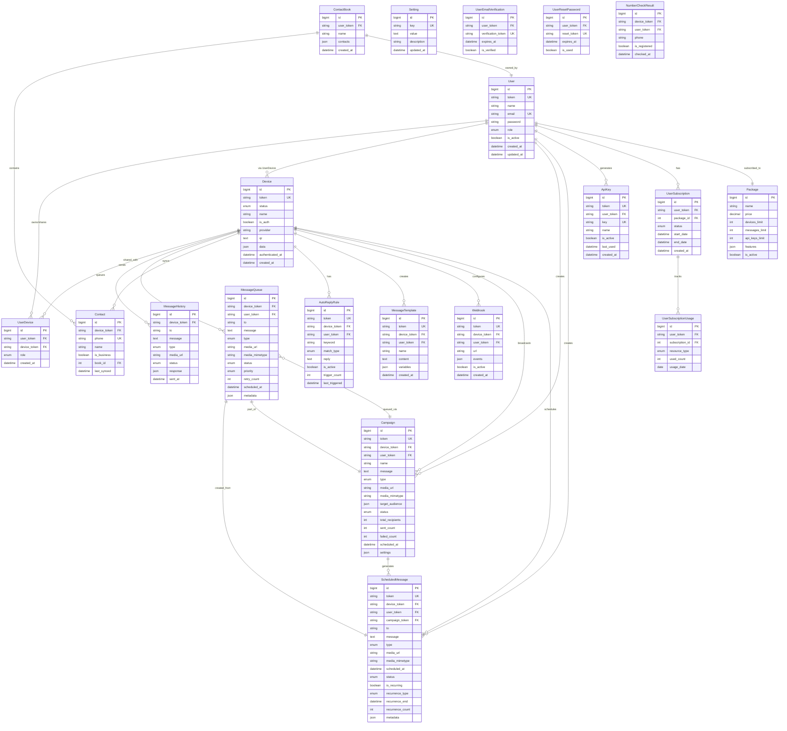

# Database Schema (ERD)

## Entity Relationship Diagram

## Table Descriptions

| Table | Purpose | Key Fields |
|-------|---------|------------|
| **User** | User accounts | email, role, is_active |
| **Device** | WhatsApp devices | token, status, provider |
| **UserDevice** | Device sharing | user-device many-to-many |
| **MessageHistory** | Sent messages log | device, to, status, sent_at |
| **MessageQueue** | Pending messages | priority, scheduled_at, retry_count |
| **Contact** | Synced WhatsApp contacts | phone, name, is_business |
| **ContactBook** | User-created contact groups | name, contacts (JSON) |
| **MessageTemplate** | Reusable message templates | name, content, variables |
| **AutoReplyRule** | Auto-reply automation | keyword, match_type, reply |
| **Campaign** | Broadcast campaigns | target_audience, sent/failed counts |
| **ScheduledMessage** | Scheduled/recurring messages | scheduled_at, recurrence_type |
| **Webhook** | Webhook integrations | url, events, is_active |
| **ApiKey** | API authentication | key, last_used |
| **Package** | Subscription plans | limits, price, features |
| **UserSubscription** | User subscriptions | package, start/end dates |
| **UserSubscriptionUsage** | Daily usage tracking | resource_type, used_count |
| **Setting** | System settings | key-value config |
| **UserEmailVerification** | Email verification tokens | verification_token, expires_at |
| **UserResetPassword** | Password reset tokens | reset_token, expires_at |
| **NumberCheckResult** | WA number check history | phone, is_registered |

## Indexes & Performance

**Key Indexes**:
- `devices.token` (UNIQUE)
- `devices.status, is_deleted, is_logged_out` (Composite)
- `message_queue.status, scheduled_at` (Queue processing)
- `message_queue.device_token, status` (Device queue)
- `message_history.device_token, sent_at` (History queries)
- `contacts.device_token, phone` (Contact lookup)
- `campaigns.status, scheduled_at` (Campaign processing)
- `scheduled_messages.status, scheduled_at` (Schedule processing)
- `user_subscription_usage.user_token, usage_date` (Quota tracking)

## Data Types Summary

**Enums Used**:
- `User.role`: USER, SUPER_ADMIN
- `Device.status`: prepare, initializing, qr, ready, authenticated, disconnected, etc.
- `Device.provider`: wwebjs, baileys
- `MessageQueue.status`: queued, processing, completed, failed, cancelled
- `MessageQueue.priority`: free, normal, premium, high
- `MessageQueue.type`: text, image, video, audio, document
- `Campaign.status`: draft, scheduled, running, completed, paused, cancelled
- `ScheduledMessage.recurrence_type`: hourly, daily, weekly, monthly, yearly
- `AutoReplyRule.match_type`: exact, contains

**JSON Fields**:
- `Device.data` - Provider-specific metadata
- `Campaign.target_audience` - Array of phone numbers
- `Campaign.settings` - min_delay, max_delay
- `MessageQueue.metadata` - campaign_token, scheduled_msg_token, delays
- `ScheduledMessage.metadata` - Custom data per schedule
- `ContactBook.contacts` - Array of contact objects
- `Webhook.events` - Subscribed event types
