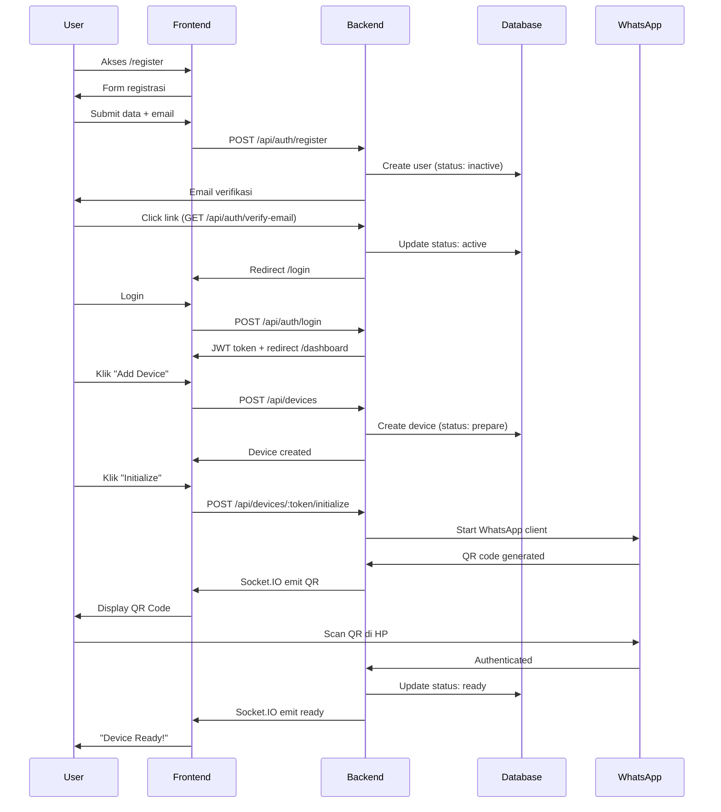
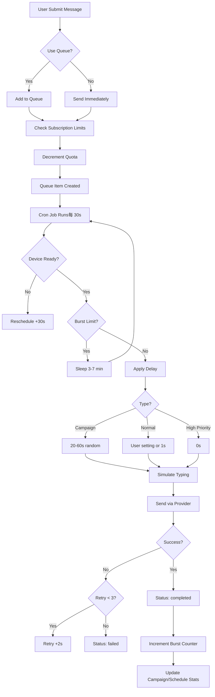
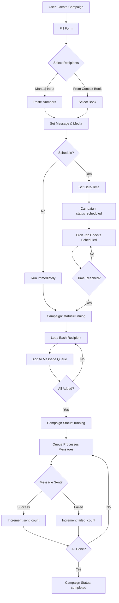
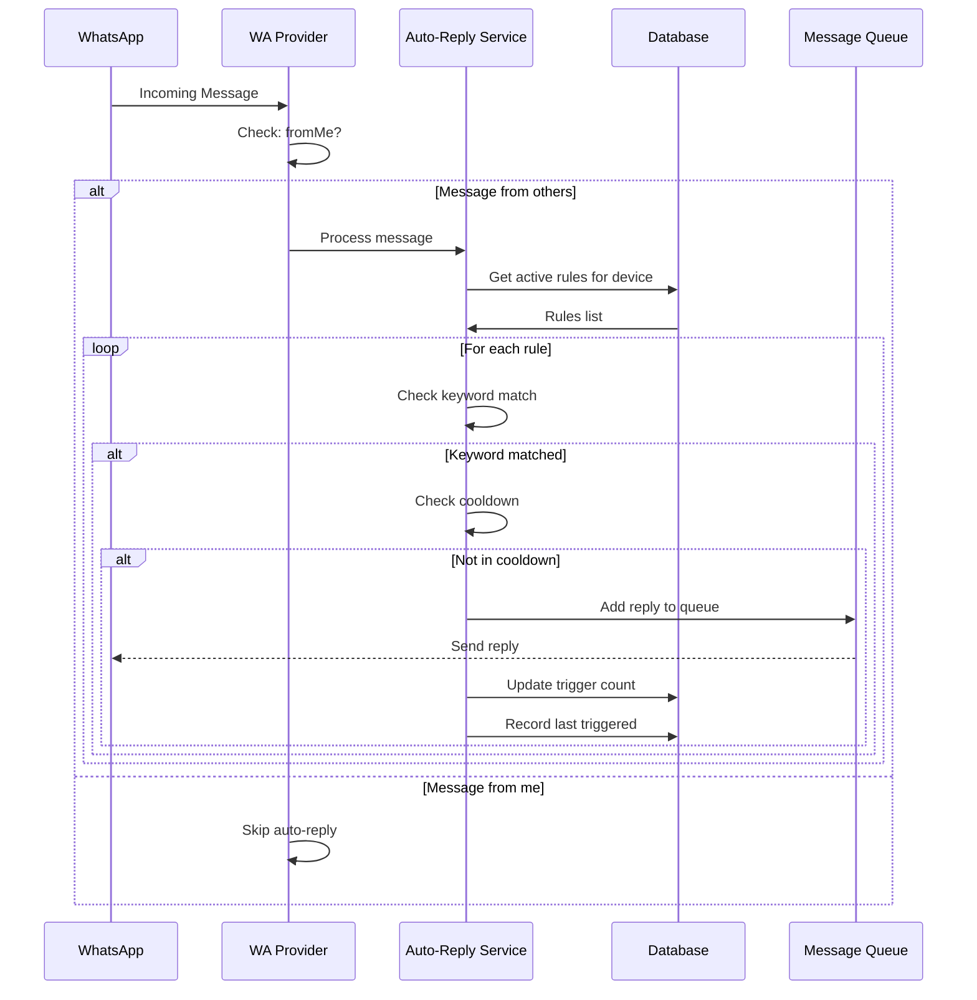
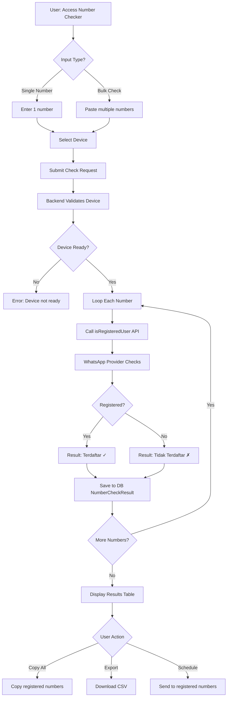
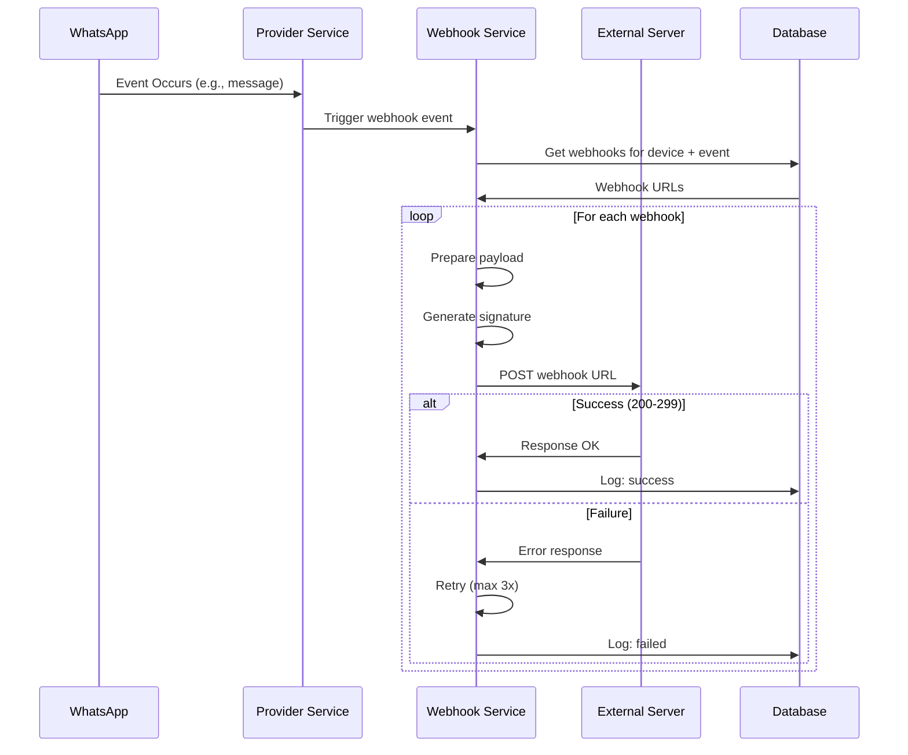
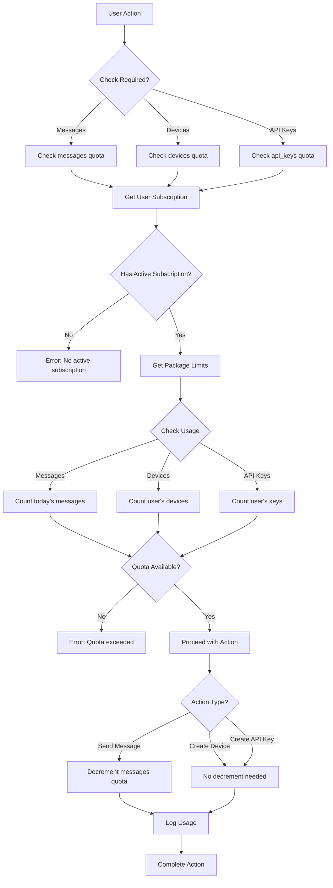

# WhatsApp Provider Application - Documentation

## Table of Contents
1. [Application Overview](#application-overview)
2. [Menu Structure](#menu-structure)
3. [Features by Category](#features-by-category)
4. [Flow Diagrams](#flow-diagrams)
5. [API Integration](#api-integration)

---

## Application Overview

**WhatsApp Provider** adalah platform lengkap untuk mengelola WhatsApp Business dengan fitur:
- Multi-device management (WhatsApp Web.js & Baileys)
- Bulk messaging & broadcasting campaigns
- Message scheduling & auto-replies
- Contact management & contact books
- Webhook integration
- API access dengan rate limiting per paket

---

## Menu Structure

### 🏠 Public Pages (Guest)
```
├── Landing Page (/)
├── Login
├── Register
├── Pricing
├── Forgot Password
├── About
├── Contact
├── Privacy Policy
├── Terms of Service
└── Cookies Policy
```

### 📱 User Dashboard (Authenticated)

```
Dashboard
├── 📊 Dashboard Overview
│   ├── Quick Stats (devices, messages, queue)
│   ├── Recent Activity
│   └── Package Usage
│
├── 📱 Devices
│   ├── Device List
│   ├── Add New Device
│   ├── QR Code Scan
│   ├── Device Settings
│   └── Invite Users (Shared Devices)
│
├── 💬 Messaging
│   ├── Send Single Message
│   ├── Send Bulk Messages
│   ├── Send Media
│   └── Message Queue Management
│
├── 📢 Campaigns
│   ├── Campaign List
│   ├── Create Campaign
│   ├── Campaign Statistics
│   └── Broadcast to Contact Books
│
├── ⏰ Scheduled Messages
│   ├── Scheduled List
│   ├── Create Schedule
│   ├── Recurring Messages
│   └── Schedule History
│
├── 👥 Contacts
│   ├── Synced Contacts (from WhatsApp)
│   ├── Contact Books
│   ├── Add Contacts Manually
│   └── Import/Export CSV
│
├── 📝 Templates
│   ├── Message Templates
│   ├── Create Template
│   ├── Template Variables
│   └── Template Library
│
├── 🤖 Auto-Replies
│   ├── Auto-Reply Rules
│   ├── Keyword Triggers
│   ├── Reply Templates
│   └── Rule Statistics
│
├── 🔗 Webhooks
│   ├── Webhook List
│   ├── Add Webhook URL
│   └── Event Subscriptions
│
├── 🛠️ Tools
│   └── Number Checker (Check WA Registration)
│
├── 📜 History
│   ├── Message History
│   ├── Filter by Status
│   ├── Export History
│   └── Clear History
│
├── ⚙️ Settings
│   ├── Profile Settings
│   ├── Messaging Settings
│   ├── API Keys
│   └── Subscription Info
│
├── 💳 Billing
│   ├── Current Package
│   ├── Usage Statistics
│   ├── Payment History
│   └── Upgrade/Downgrade
│
└── 📖 API Docs
    └── API Documentation
```

### 👑 Admin Panel (Admin Only)

```
Admin Panel
├── 📊 Admin Dashboard
│   ├── System Statistics
│   ├── Active Users
│   └── Revenue Overview
│
├── 👤 Users Management
│   ├── User List (Datatable)
│   ├── Create User
│   ├── Edit User
│   ├── Toggle Status (Active/Inactive)
│   └── Delete User
│
├── 📦 Packages
│   ├── Package List
│   ├── Create Package
│   ├── Edit Limits (devices, messages, api_keys)
│   ├── Pricing
│   └── Delete Package
│
└── ⚙️ Admin Settings
    └── System Configuration
```

---

## Features by Category

### 1. 📱 Device Management

| Feature | Description | Access |
|---------|-------------|--------|
| **Multi-Provider Support** | Support WhatsApp Web.js & Baileys | All users |
| **QR Code Authentication** | Real-time QR code untuk pairing | All users |
| **Device Status Monitoring** | Live status: ready, disconnected, qr, etc. | All users |
| **Multi-Device Sharing** | Invite users lain untuk shared device | Device owner |
| **Device Logout** | Logout dari WhatsApp Web | Device owner |
| **Auto-Reconnect** | Automatic reconnection on disconnect | System |
| **Number Validation** | Check if phone numbers registered on WhatsApp | All users |

### 2. 💬 Messaging System

| Feature | Description | Access |
|---------|-------------|--------|
| **Send Single Message** | Kirim pesan ke 1 nomor | All users |
| **Bulk Messaging** | Kirim ke multiple nomor sekaligus | All users |
| **Media Messages** | Kirim gambar, video, audio, dokumen | All users |
| **Template Variables** | Placeholder: {name}, {phone}, {custom} | All users |
| **Message Queue** | Queue system dengan priority (high/normal/low) | System |
| **Retry Logic** | Auto retry untuk failed messages | System |
| **Typing Simulation** | Simulate human typing untuk anti-ban | System |
| **Burst Protection** | Limit 5-8 pesan, cooldown 3-7 menit | System |

### 3. 📢 Campaign Management

| Feature | Description | Access |
|---------|-------------|--------|
| **Broadcast Campaigns** | Kirim pesan ke banyak kontak sekaligus | All users |
| **Contact Book Integration** | Import recipients dari contact books | All users |
| **Scheduled Campaigns** | Set tanggal/waktu launch campaign | All users |
| **Campaign Throttling** | Random delay 20-60s antar pesan | System |
| **Progress Tracking** | Real-time tracking: sent, failed, pending | All users |
| **Campaign Statistics** | Success rate, delivery stats | All users |
| **Auto-Pause on Fail** | Stop campaign jika error rate tinggi | System |

### 4. ⏰ Scheduled Messages

| Feature | Description | Access |
|---------|-------------|--------|
| **One-Time Schedule** | Jadwalkan pesan untuk waktu tertentu | All users |
| **Recurring Messages** | Repeat: hourly, daily, weekly, monthly, yearly | All users |
| **Recurrence End Date** | Set batas akhir recurring | All users |
| **Series History** | View history dari recurring schedule | All users |
| **Cancel Schedule** | Cancel sebelum terkirim | Creator |
| **Schedule Stats** | Pending, sent, failed counters | All users |

### 5. 👥 Contact Management

| Feature | Description | Access |
|---------|-------------|--------|
| **Auto-Sync from WhatsApp** | Sync kontak dari device | All users |
| **Contact Books** | Organize contacts ke groups | All users |
| **Manual Add** | Tambah kontak manual | All users |
| **Bulk Import CSV** | Import dari file CSV | All users |
| **Search & Filter** | Cari berdasarkan nama/nomor | All users |
| **Contact Details** | Nama, nomor, business status | All users |
| **Last Synced Tracking** | Track kapan terakhir sync | System |

### 6. 📝 Template Library

| Feature | Description | Access |
|---------|-------------|--------|
| **Message Templates** | Save frequently used messages | All users |
| **Template Variables** | Dynamic placeholders | All users |
| **Template Categories** | Organize by type | All users |
| **Quick Insert** | Insert template saat compose message | All users |
| **Template Sharing** | Share antar device (jika multi-user) | Device users |

### 7. 🤖 Auto-Reply System

| Feature | Description | Access |
|---------|-------------|--------|
| **Keyword Triggers** | Auto-reply based on keyword | All users |
| **Exact/Contains Match** | Match type configuration | All users |
| **Multiple Rules** | Set multiple auto-reply rules per device | All users |
| **Enable/Disable Toggle** | Control aktif/tidak per rule | All users |
| **Reply Statistics** | Track berapa kali triggered | All users |
| **Cooldown Period** | Prevent spam replies | System |

### 8. 🔗 Webhook Integration

| Feature | Description | Access |
|---------|-------------|--------|
| **Event Subscriptions** | Subscribe to: message_create, qr, ready, etc. | All users |
| **Multiple Webhooks** | Multiple webhook URLs per device | All users |
| **Retry on Failure** | Auto-retry jika webhook gagal | System |
| **Signature Verification** | Secure webhook dengan signature | System |
| **Webhook Logs** | Track delivery success/failure | All users |

### 9. 🔑 API Access

| Feature | Description | Access |
|---------|-------------|--------|
| **API Key Generation** | Generate `wf_` prefixed keys | All users |
| **Public API (v1)** | REST API untuk external integrations | API users |
| **Private API** | Server-to-server API dengan master key | Internal only |
| **Rate Limiting** | Limit berdasarkan package subscription | System |
| **API Documentation** | Interactive API docs | All users |
| **Usage Tracking** | Track API call quota | System |

### 10. 📊 Monitoring & Analytics

| Feature | Description | Access |
|---------|-------------|--------|
| **Dashboard Overview** | Stats: devices, messages, queue | All users |
| **Message History** | Complete history dengan filter | All users |
| **Real-time Updates** | Socket.IO untuk live updates | All users |
| **Export Data** | Export history ke CSV/Excel | All users |
| **Usage Statistics** | Track message quota per subscription | All users |
| **Health Status** | Device health monitoring | All users |

### 11. 👑 Admin Features

| Feature | Description | Access |
|---------|-------------|--------|
| **User Management** | CRUD users | Super Admin |
| **Package Management** | CRUD subscription packages | Super Admin |
| **System Settings** | Global app configuration | Super Admin |
| **User Statistics** | Total users, active, revenue | Super Admin |
| **Force Actions** | Force logout/delete any device | Super Admin |

### 12. 🔐 Security & Auth

| Feature | Description | Access |
|---------|-------------|--------|
| **Email Verification** | Verify email saat register | All users |
| **Password Reset** | Forgot password flow | All users |
| **Session Management** | Secure JWT/session tokens | System |
| **Role-Based Access** | USER / SUPER_ADMIN roles | System |
| **API Key Auth** | Bearer token authentication | API users |
| **Subscription Middleware** | Check quota before action | System |

---

## Flow Diagrams

### Flow 1: User Registration & Device Setup



### Flow 2: Send Message (Queue System)



### Flow 3: Campaign Creation & Execution



### Flow 4: Auto-Reply System



### Flow 5: Number Checker Tool



### Flow 6: Webhook Event Flow



### Flow 7: Subscription & Quota Management



---

## API Integration

### Authentication Methods

| Method | Header | Use Case | Limit |
|--------|--------|----------|-------|
| **JWT Session** | `Authorization: Bearer <jwt>` | Web dashboard | N/A |
| **API Key (Public)** | `X-API-Key: wf_xxxxxxxx` | External integrations | Package-based |
| **Internal Auth** | `X-Internal-Key: <master>` | Server-to-server | Unlimited |

### API Endpoints Summary

| Category | Endpoints | Auth Required |
|----------|-----------|---------------|
| **Auth** | `/api/auth/*` | Public + JWT |
| **Devices** | `/api/devices/*` | JWT / API Key |
| **Messages** | `/api/messages/*` | JWT / API Key |
| **Campaigns** | `/api/campaigns/*` | JWT / API Key |
| **Contacts** | `/api/contacts/*` | JWT |
| **Templates** | `/api/templates/*` | JWT |
| **Auto-Replies** | `/api/auto-replies/*` | JWT |
| **Webhooks** | `/api/webhooks/*` | JWT |
| **Dashboard** | `/api/dashboard` | JWT |
| **Admin** | `/api/admin/*` | JWT + Admin |

### Example API Usage

**Send Single Message via API**:
```bash
curl -X POST https://api.example.com/api/v1/messages/send \
  -H "X-API-Key: wf_your_api_key_here" \
  -H "Content-Type: application/json" \
  -d '{
    "device_token": "ABC123",
    "to": "628123456789",
    "message": "Hello from API!"
  }'
```

**Send Bulk Messages**:
```bash
curl -X POST https://api.example.com/api/v1/messages/bulk \
  -H "X-API-Key: wf_your_api_key_here" \
  -H "Content-Type: application/json" \
  -d '{
    "device_token": "ABC123",
    "recipients": [
      {"to": "628111111111", "message": "Hi User 1"},
      {"to": "628222222222", "message": "Hi User 2"}
    ],
    "use_queue": true
  }'
```

---

## Tech Stack

🔧 **Backend**:
- Node.js + Express.js
- Sequelize ORM (MySQL/MariaDB)
- Socket.IO (Real-time updates)
- WhatsApp Web.js & Baileys (Multi-provider)
- Node-cron (Scheduled tasks)

🎨 **Frontend**:
- EJS Templates
- Bootstrap 5 / TailwindCSS
- Socket.IO Client
- DataTables.js
- Chart.js

📦 **Infrastructure**:
- Session management
- File upload (express-fileupload)
- Email service (Nodemailer)
- Logging (Winston/Custom)

---

## Key Features Summary

✅ **Multi-Device**: Manage beberapa WhatsApp devices  
✅ **Multi-Provider**: Support wwebjs & baileys  
✅ **Queue System**: Smart message queueing dengan retry  
✅ **Anti-Ban**: Burst protection, typing simulation, delays  
✅ **Campaigns**: Broadcast dengan progress tracking  
✅ **Scheduling**: One-time & recurring messages  
✅ **Auto-Reply**: Keyword-based automation  
✅ **API Access**: REST API untuk integration  
✅ **Webhooks**: Event-driven integrations  
✅ **Contact Books**: Organize & import contacts  
✅ **Templates**: Reusable message templates  
✅ **Real-time**: Live updates via Socket.IO  
✅ **Admin Panel**: Full user & package management
